# Eventre By Themefisher
Eventre is a clean and powerful Bootstrap template dedicated to all kinds of Events, Conferences and Meetups. It offers many various possibilities which will help you easily create a beautiful, stunning and unique website.

<!-- demo -->
## Example Site
| [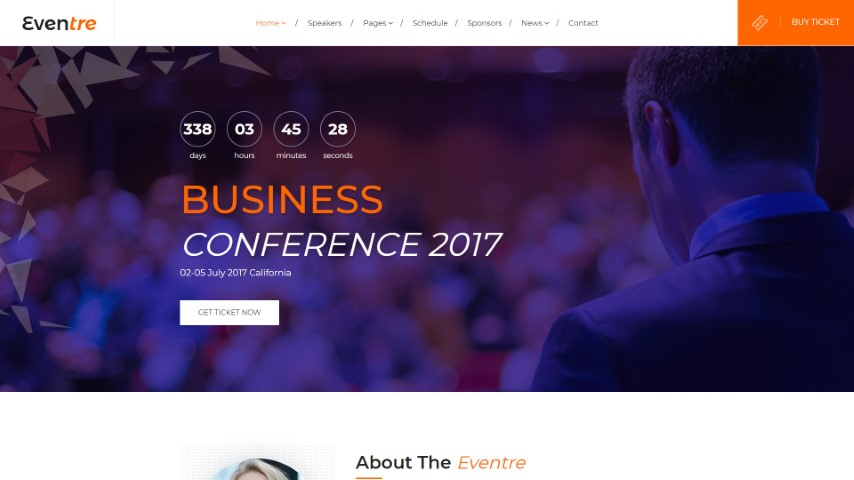](https://demo.themefisher.com/eventre/) | [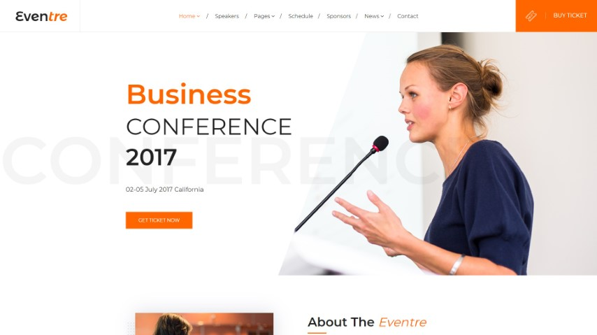](https://demo.themefisher.com/eventre/homepage-two.html) | [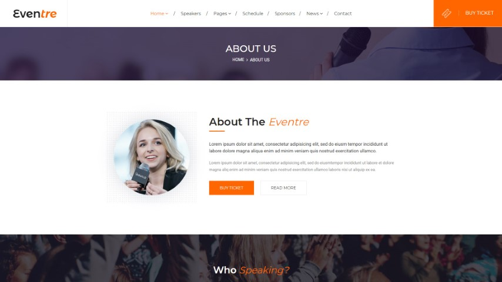](https://demo.themefisher.com/eventre/about.html) | [](https://demo.themefisher.com/eventre/speakers.html) |
|:---:|:---:|:---:|:---:|
| **Home 1**  | **Home 2**  | **About** | **Speaker** |
| [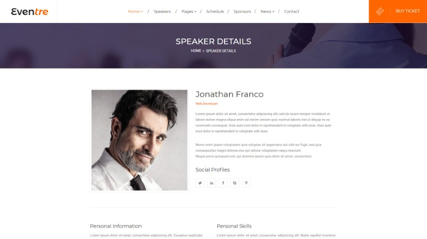](https://demo.themefisher.com/eventre/single-speaker.html) | [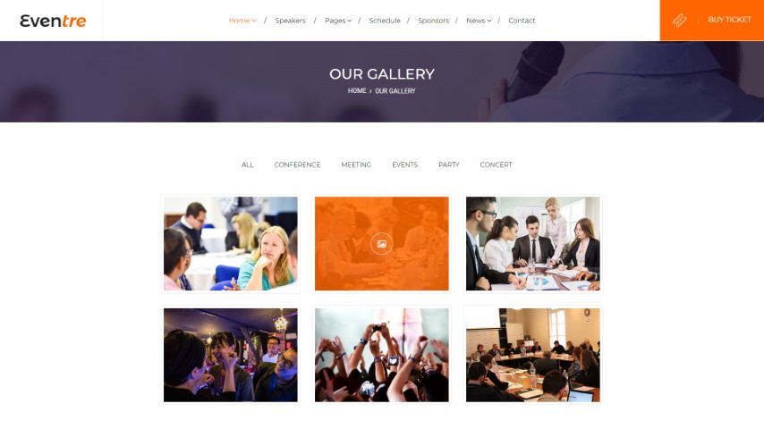](https://demo.themefisher.com/eventre/gallery.html) | [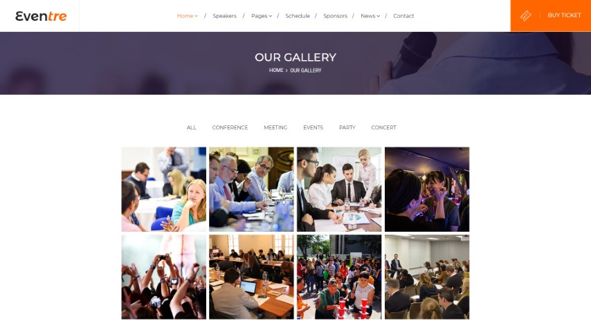](https://demo.themefisher.com/eventre/gallery-two.html) | [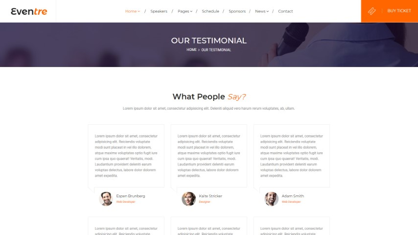](https://demo.themefisher.com/eventre/testimonial.html) |
| **Speaker Details**  | **Gallery**  | **Gallery 2** | **Testimonial** |
| [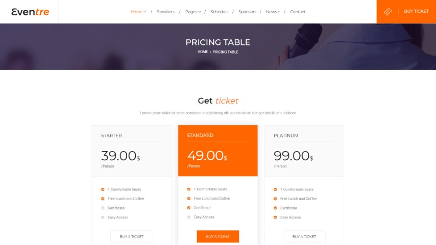](https://demo.themefisher.com/eventre/pricing.html) | [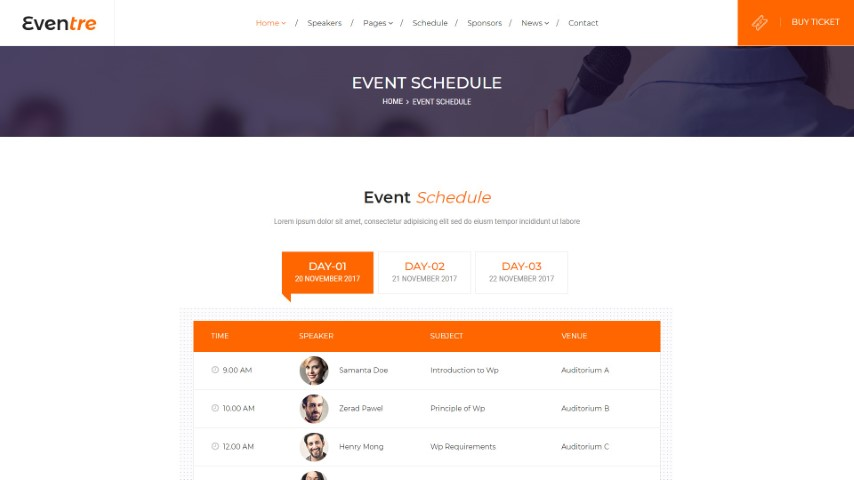](https://demo.themefisher.com/eventre/schedule.html) | [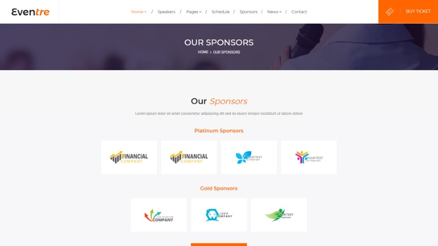](https://demo.themefisher.com/eventre/sponsors.html) | [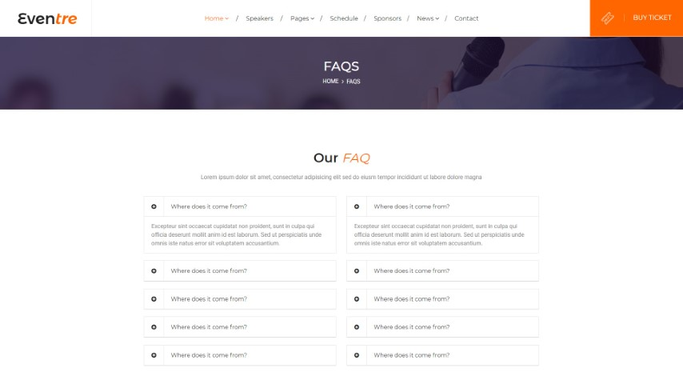](https://demo.themefisher.com/eventre/FAQ.html) |
| **Pricing**  | **Schedule**  | **Sponsors** | **FAQ** |
| [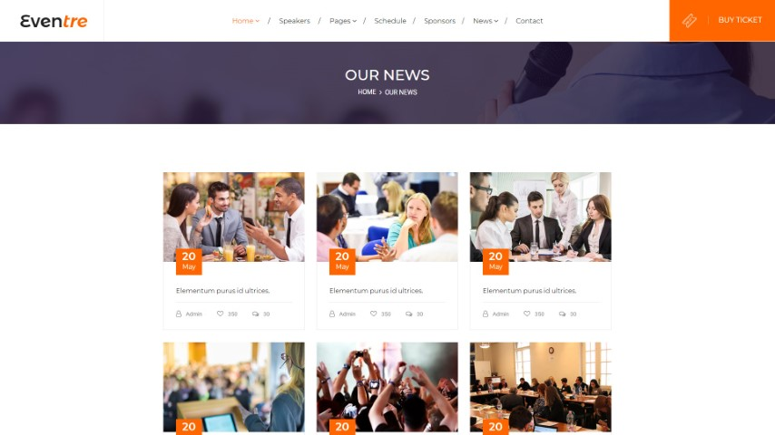](https://demo.themefisher.com/eventre/news.html) | [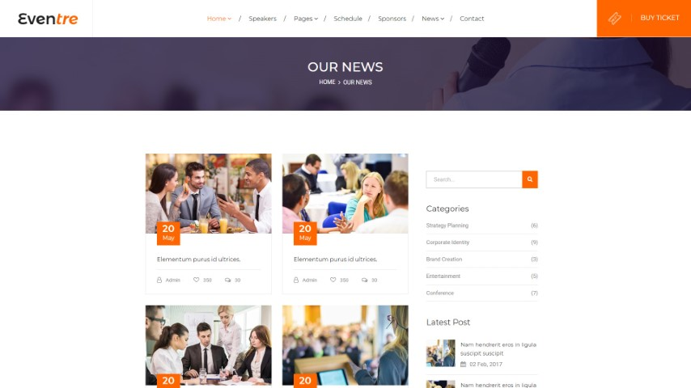](https://demo.themefisher.com/eventre/news-right-sidebar.html) | [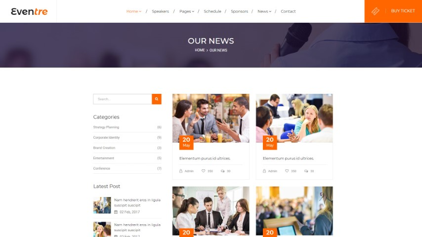](https://demo.themefisher.com/eventre/news-left-sidebar.html) | [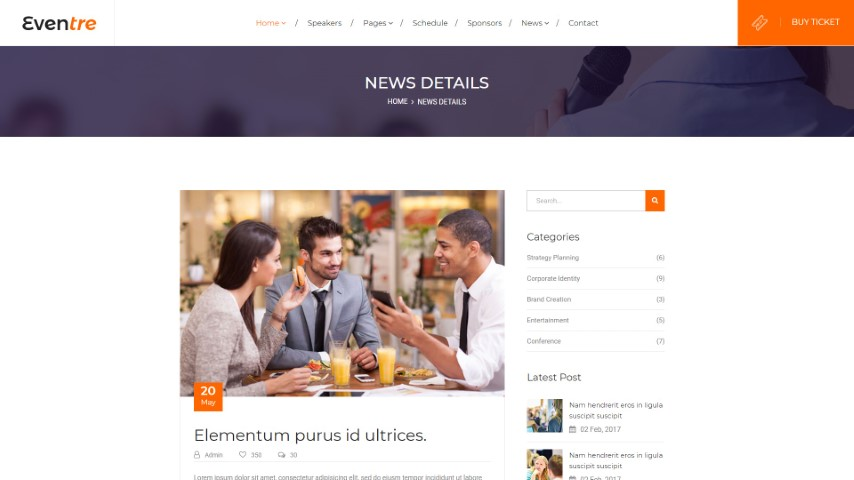](https://demo.themefisher.com/eventre/news-single.html) |
| **News** | **News Right Sidebar**  | **News Left Sidebar**  |**News Details** |
| [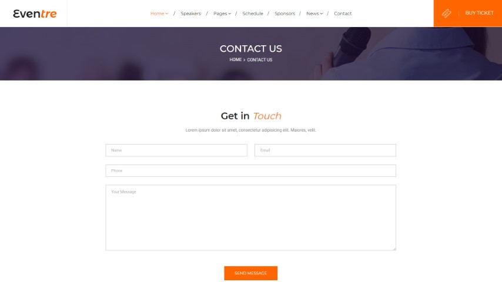](https://demo.themefisher.com/eventre/contact.html) | [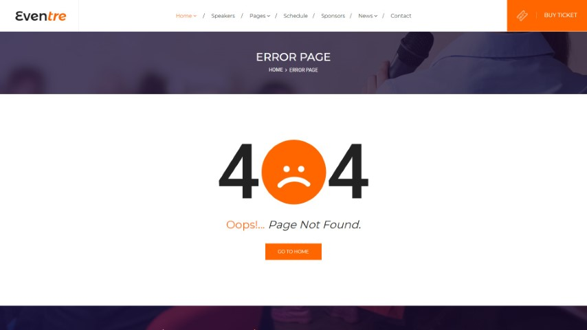](https://demo.themefisher.com/eventre/404.html)
| **Contact** | **404**  |

👉🏻[View Live Preview](https://demo.themefisher.com/eventre/)

<!-- resources -->
## Pages
* **Home 1**
* **Home 2**
* **About**
* **Schedule**
* **Speakers**
* **Speakers Single**
* **Gallery**
* **Gallery Two**
* **Sponsors**
* **Pricing**
* **Testimonials**
* **FAQ**
* **News**
* **News Left Sidebar**
* **News Right Sidebar**
* **News Single**
* **Contact**
* **404**


<!-- download -->
## Download And installation
Download this template from any following options:

* Download from [Github](https://github.com/themefisher/Eventre-Event-Conference-Template/archive/master.zip)
* Clone the repository: `git clone https://github.com/themefisher/Eventre-Event-Conference-Template.git`
* Download from [Themefisher](https://themefisher.com/products/eventre-event-conference-website-template/)


<!-- installation -->
### Basic Usage
After downloading template, you can simply edit the HTML and CSS files from the `theme` folder. To preview the changes you make to the code, you can open the index.html file in your web browser.

### Advanced Usage
For advanced usage you have some dependencies to install. Then you can run it on your localhost. You can view the package.json file to see which scripts are included.

#### Install Dependencies
* **Node Installation:** [Install node js](https://nodejs.org/en/download/)
* **Gulp Installation:** Install gulp globally from your terminal 
```
npm install --global gulp-cli
```
Or visit original [docs](https://gulpjs.com/docs/en/getting-started/quick-start)

#### Run Theme
After successfully install those dependencies, open this theme with any IDE [[VS Code](https://code.visualstudio.com/) recommended], and then open internal terminal of IDM [vs code shortcut <code>ctrl/cmd+\`</code>]

* Install node package modules
```
npm install
```
* Run gulp
```
gulp
```
After that, it will open up a preview of the template in your default browser, watch for changes to core template files, and live reload the browser when changes are saved.

👉🏻 [visit documentation](https://docs.themefisher.com/eventre/)


<!-- reporting issue -->
## Reporting Issues
We use GitHub Issues as the official bug tracker for the Eventre Template. Please Search [existing issues](https://github.com/themefisher/Eventre-Event-Conference-Template/issues). It’s possible someone has already reported the same problem.
If your problem or idea has not been addressed yet, feel free to [open a new issue](https://github.com/themefisher/Eventre-Event-Conference-Template/issues).

<!-- support -->
## Technical Support or Questions (Paid)
If you have questions or need help integrating the product please [contact us](mailto:mehedi@themefisher.com) instead of opening an issue.

<!-- licence -->
## License
Copyright &copy; 2021 Designed & Developed by [Themefisher](https://themefisher.com)

**Code License:** Released under the [MIT](https://github.com/themefisher/Eventre-Event-Conference-Template/blob/master/LICENSE) license.

**Image license:** The images are only for demonstration purposes. They have their own licence, we don't have permission to share those image.

<!-- resources -->
## Resources
Some third-party plugins that we used to build this template. Please check their licence.
* **Bootstrap v4.5.3**: https://getbootstrap.com/docs/4.5/getting-started/introduction/
* **Jquery**: https://jquery.com/download/
* **Google Fonts**: http://fonts.google.com/
* **Slick**: https://kenwheeler.github.io/slick/
* **Shuffle**: https://vestride.github.io/Shuffle/
* **SyoTimer**: http://syomochkin.xyz/folio/syotimer/demo.html
* **Magnific Popup**: https://dimsemenov.com/plugins/magnific-popup/
* **Font Awesome Free**: https://fontawesome.com/
